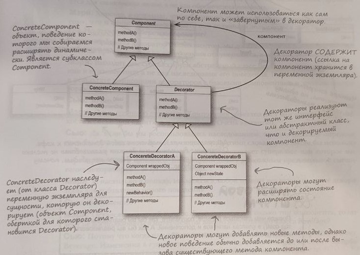

[ко всем паттернам](../../README.md)

## Паттерн декоратор

Паттерн декоратор динамически наделяет объект новыми возможностями и является гибкой альтернативой субклассированию в области расширения функциональности.

Примеры использования:
* starbuzz - пример кофейни, где мы декорируем кофе различными дополнениями
* inputstream - пример декоратора для существующего типа классов, в данном примере InputStream

