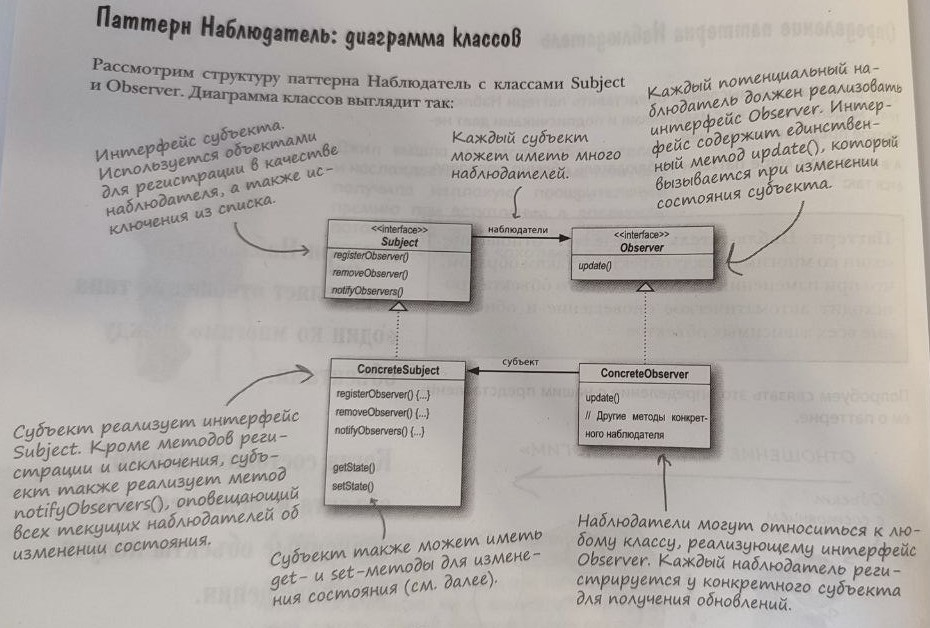

[ко всем паттернам](../../README.md)

## Паттерн наблюдатель

Наблюдатель определяет отношение "один ко многим" между объектами таким образом, что при изменении состояния одного объекта происходит автоматическое оповещение и обновление всех зависимых объектов.

